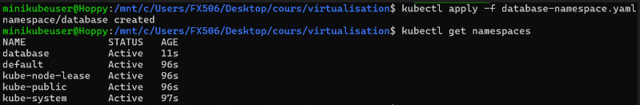
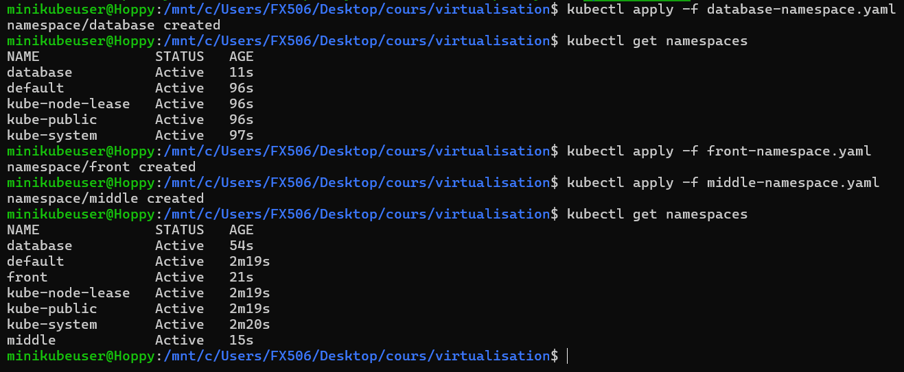
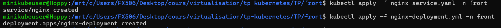
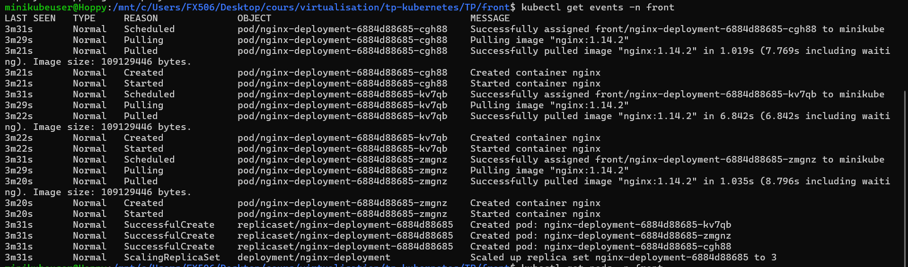
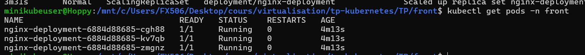
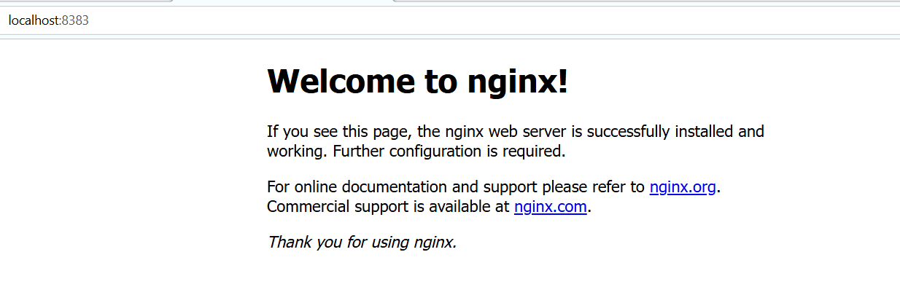
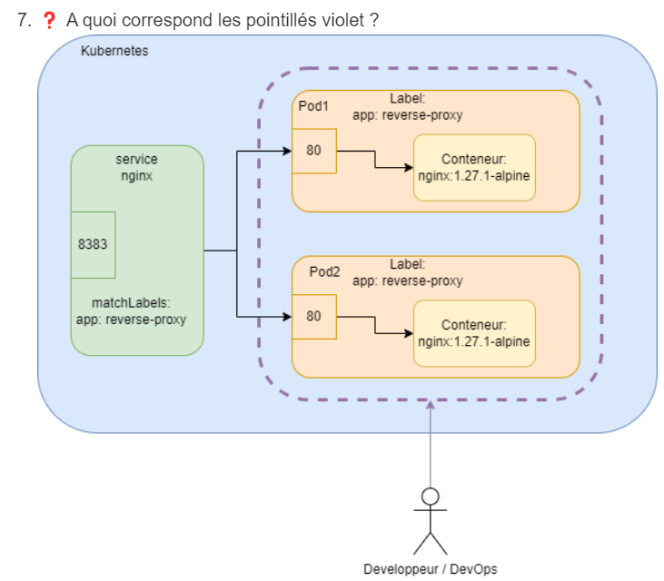
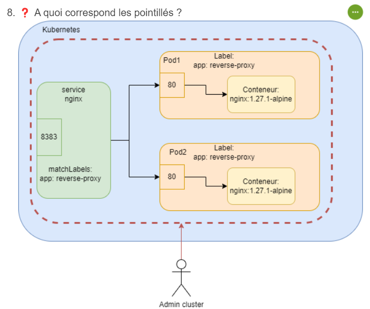

# Compte rendu Partie 1 : Virtualisation 

## Partie 1 : Namespaces

1) Création des fichiers yaml : 
    - database-namespace.yaml
        ```bash 
        apiVersion: v1
        kind: Namespace
        metadata:
            name: database
        ```
    - front-namespace.yaml
        ```bash 
        apiVersion: v1
        kind: Namespace
        metadata:
            name: front
        ```
    - middle-namespace.yaml
        ```bash 
        apiVersion: v1
        kind: Namespace
        metadata:
            name: middle
        ```

2) Liste des namespaces sur le cluster Minikube : 

(n'ayant pas pris de capture d'écran avant l'ajout de mon premier namespace database , j'ai mis celui la avant de rajouter les deux autres)

3) Deployement des namespaces



## Partie 2 : NGinx

1) Modification du fichier nginx-deployment.yml (dans le dossier TP/front)
    ```bash 
        apiVersion: apps/v1
    kind: Deployment
    metadata:
    name: nginx-deployment
    spec:
    replicas: 3
    selector:
        matchLabels:
        app: reverse-proxy
    template:
        metadata:
        labels:
            app: reverse-proxy
        spec:
        containers:
        - name: nginx
            image: nginx:1.14.2
            ports:
            - containerPort: 80
2) Modification du fichier nginx-service.yml (dans le dossier TP/front)
    ```bash 
    apiVersion: v1
    kind: Service
    metadata:
    name: nginx
    spec:
    selector:
        app: reverse-proxy
    ports:
        - protocol: TCP
        port: 8383
        targetPort: 80

3) Vérification de la réussite du déployement des ressources dans TP/front:
 

4) Voici les deux commandes pour vérifier les events du namespace et le bon démarrage des pods et de leurs conteneurs :
    - Vérifier les events : 
        ```bash
        kubectl get events -n front
        ```
        Résultat:
         


    - Vérifier le bon démarrage : 
        ```bash
        kubectl get pods -n front
        ```
        Résultat
         

5) Creer une redirection vers le port utilisation du port 8383 : 
    ```bash
    kubectl port-forward -n front svc/nginx 8383:8383

6) Résultat obtenu : 
 



Les pointillés violets correspondent à un ensemble de Pods gérés par un ensemble Deployment dans Kubernetes


Les pointillés rouges correspondent aux limites du cluster Kubernetes, à l'intérieur  les Pods et les Services sont déployés.

