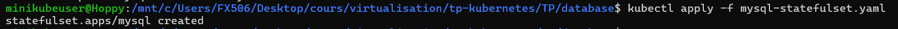
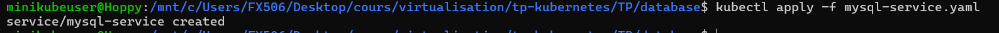
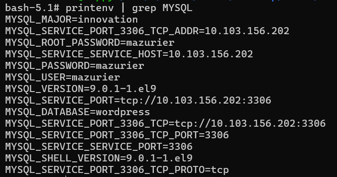
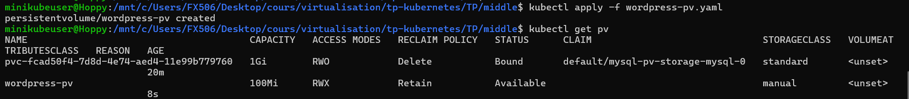
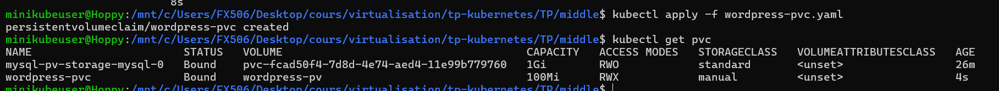
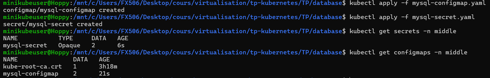
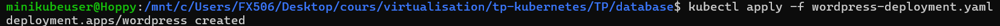
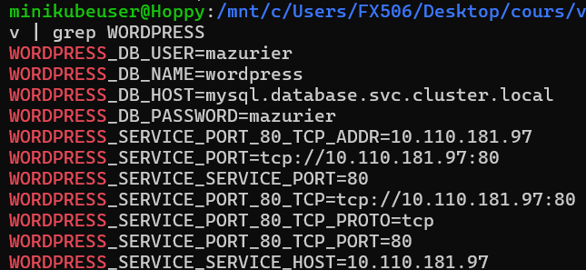
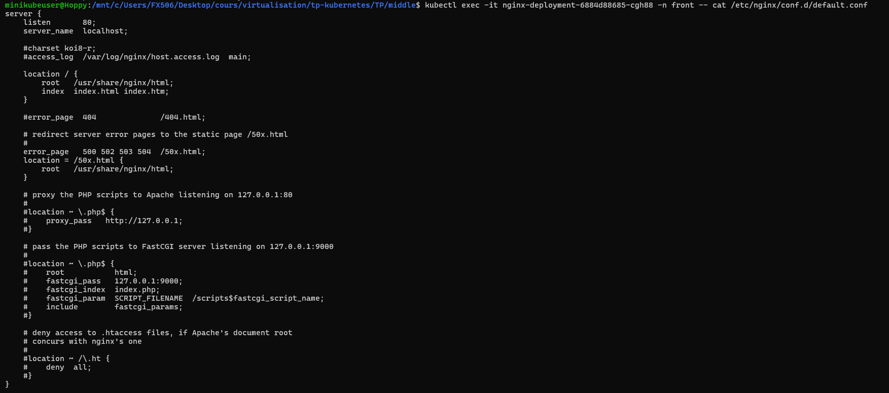
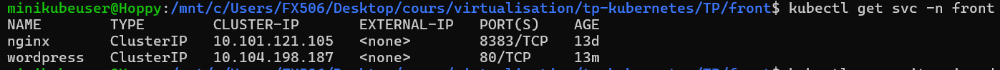

# Compte rendu Partie 2 : Virtualisation 

## Partie 1 : Namespaces

1) Création du fichier : mysql-secret.yaml : 
    ```bash 
    apiVersion: v1
    kind: Secret
    metadata:
        name: mysql-secret
        labels:
            app: mysql
    type: Opaque
    data:
        MYSQL_PASSWORD: bWF6dXJpZXI=
        MYSQL_ROOT_PASSWORD: bWF6dXJpZXI=
    ```
    Les mot de passe codés en base64 signifient "mazurier"


2) Création du fichier : mysql-configmap.yaml
    ```bash 
    apiVersion: v1
    kind: ConfigMap
    metadata:
    name: mysql-configmap
    labels:
        app: mysql
    data:
    MYSQL_USER: mazurier
    MYSQL_DATABASE: wordpress
    ```


3) Création du fichier : mysql-statefulset.yaml
    (disponible dans le dossier fichier_yaml)
    
    Avec déploiement du fichier : 
    ```bash 
        kubectl apply -f mysql-statefulset.yaml
    ```


4) Création du fichier mysql-service.yaml
    ```bash 
    apiVersion: v1
    kind: Service
    metadata:
        name: mysql-service
        labels:
          app: mysql
    spec:
        selector:
          app: mysql
    ports:
        - protocol: TCP
        port: 3306
        targetPort: 3306
    type: ClusterIP
    ```


5) Connexion au pod MySQL et vérification des 4 variables d'environnement 
Résultat :


Commandes utilisées : 
```bash
    kubectl exec -it mysql-0 -- /bin/bash
    printenv | grep MYSQL
```


## Partie 2 : Wordpress 

1) Création du fichier : wordpress-pv.yaml
    ```bash 
    apiVersion: v1
    kind: PersistentVolume
    metadata:
    name: wordpress-pv
    spec:
    capacity:
        storage: 100Mi
    accessModes:
        - ReadWriteMany 
    persistentVolumeReclaimPolicy: Retain  
    storageClassName: manual  
    hostPath:                 
        path: /tmp/kubernetes/wordpress
    ```
    
    On déploie le fichier avec la commande : 
    ```bash 
    kubectl apply -f wordpress-pv.yaml
    ```
    puis on vérifie que le PersistentVolume à bien été créé à l'aide de cette commande : 
    ```bash 
    kubectl get pv
    ```
Résultat : 



2) Création du fichier : wordpress-pvc.yaml
    ```bash 
    apiVersion: v1
    kind: PersistentVolumeClaim
    metadata:
    name: wordpress-pvc
    spec:
    accessModes:
        - ReadWriteMany  
    resources:
        requests:
        storage: 100Mi 
    storageClassName: manual
    ```

    Avec déploiement et vérification que PersistentVolumeClaim a été créé:
    ```bash 
    kubectl apply -f wordpress-pvc.yaml
    kubectl get pv
    ```
Résultat : 


3) et 4) Déploiement des ressources Secret sur le namespace : middle 
Il faut changer dans les fichiers yaml 
```bash 
metadata:
    namespace : middle
```
Puis executer les commandes ici pour le déploiement des ressources :
```bash
kubectl apply -f mysql-secret.yml
kubectl apply -f mysql-configmap.yml
```
Puis executer les commandes ci dessous pour vérifier:
```bash
kubectl get secrets -n middle
kubectl get configmaps -n middle
```

Résultat :



5) Création du fichier wordpress-deployment.yaml

Résultat : 



6) Création du fichier wordpress-service.yaml
```bash 
apiVersion: v1
kind: Service
metadata:
  name: wordpress-service
  labels:
    app: blog
spec:
  selector:
    app: blog
  ports:
    - protocol: TCP
      port: 80        
      targetPort: 80  
  type: ClusterIP  
```

7) Vérification des variables d'environnement avec les variables définies : 



 
Résumé de la Résolution du Problème de Connexion de WordPress à MySQL
1) Création des Ressources Kubernetes :

J'ai créé les fichiers YAML nécessaires pour déployer WordPress et MySQL, ainsi qu'un service pour exposer WordPress :
    - wordpress-deployment.yaml
    - wordpress-service.yaml 
    - wordpress-pv.yaml et wordpress-pvc.yaml 

2) Déploiement des Ressources :

J'ai appliqué les fichiers de configuration pour déployer les ressources dans le namespace middle :
```bash
kubectl apply -f wordpress-pv.yaml
kubectl apply -f wordpress-pvc.yaml
kubectl apply -f wordpress-deployment.yaml
kubectl apply -f wordpress-service.yaml
```

3) Vérification des Déploiements et des Événements :

J'ai vérifié l'état des déploiements et des pods :
```bash
kubectl get pods -n middle
kubectl get events -n middle --sort-by='.metadata.creationTimestamp'
```
J'ai remarqué des erreurs indiquant que le PersistentVolumeClaim (PVC) wordpress-pvc était Pending, ce qui empêchait le pod WordPress de démarrer.

4) Création du PersistentVolume (PV) :

Après avoir compris que le PVC était en attente en raison d'une absence de PV disponible, j'ai défini un PV et un PVC, en m'assurant qu'ils soient correctement configurés pour utiliser la classe de stockage standard.
Vérification et Correction des Problèmes :

J'ai utilisé les commandes suivantes pour obtenir des informations sur les PVC et PV :
```bash
kubectl get pvc -n middle
kubectl get pv
```

J'ai corrigé le PVC en m'assurant qu'il soit lié à un PV existant et approprié.

5) Vérification des Variables d'Environnement dans le Pod WordPress :

Une fois que les ressources étaient correctement configurées et que le PVC était Bound, j'ai vérifié les variables d'environnement dans le pod WordPress pour m'assurer qu'elles étaient définies comme attendu :
```bash
kubectl exec -it wordpress-<pod-name> -n middle -- printenv | grep WORDPRESS
```


Debeuging : 
Vérification dans le fichier default.conf pour vérifier le port suite à une erreur de Database Error



Je vérifie si le serveur Nginx est exposé avec cette commande :
```bash 
kubectl get svc -n front
```

Problème avec l'accès à la page d'installation de wordpress : 

1/ Vérification su service nginx  avec curl 
```bash 
minikubeuser@Hoppy:/mnt/c/Users/FX506/Desktop/cours/virtualisation/tp-kubernetes/TP/front$ curl http://wordpress.front.svc.cluster.local
curl: (6) Could not resolve host: wordpress.front.svc.cluster.local
```

Je vérifie la disponibilité du service WordPress avec cette commande : 
```bash 
kubectl get svc -n front
```

Voila donc ce que je trouve : 


Donc le service wordpress est bien là

Vérifications : 

1. Les différentes ressources sont déployées dans le bon namespace ? Quelle commande utilisez-vous pour vérifier cela ?
Commande :
```bash 
kubectl get all --namespace <nom-du-namespace>
```
Explication : La commande kubectl get all --namespace <nom-du-namespace> permet de lister toutes les ressources (Pods, Services, ConfigMaps, Deployments, etc.) dans un namespace spécifique. Cela vous aide à vérifier que les ressources sont bien déployées dans le bon namespace.

2. Les ressources MySQL ConfigMap et MySQL sont à déployer au sein des namespaces middle et database, pourquoi ?

Explication :
- Séparation logique et isolation des ressources : En utilisant des namespaces séparés comme middle et database, on peut isoler les ressources de différentes couches (ex. application, base de données) au sein du cluster.
- Gestion des accès et sécurité : Les namespaces permettent de restreindre les permissions et l’accès aux ressources spécifiques. Par exemple, le namespace database peut avoir des permissions spécifiques pour les secrets et ConfigMaps sensibles nécessaires pour MySQL.
- Organisation et gestion de ressources : Cela rend également la gestion des ressources plus facile et permet un meilleur suivi de l’utilisation des ressources par couche.

3. . Les différents pods sont-ils correctement démarrés ? Quelle commande utilisez-vous pour vérifier cela ?
Commande :
```bash
kubectl get pods --namespace <nom-du-namespace>
```
Explication : La commande permet de voir l’état de chaque Pod dans un namespace particulier. Le statut "Running" signifie que le Pod fonctionne correctement. Pour des informations supplémentaires sur chaque Pod, on peut aussi utiliser :
```bash
kubectl describe pod <pod-name> --namespace <nom-du-namespace>
```

4.Lorsqu'un pod est en erreur, comment accédez-vous aux events du namespace et aux logs du pod ? Quelles commandes utilisez-vous pour vérifier cela ?
Pour accéder aux events du namespace :
```bash
kubectl get events --namespace <nom-du-namespace>
```

Pour accéder aux logs du pod en erreur :
```bash
kubectl logs <nom-du-pod> --namespace <nom-du-namespace>
```

Explication :
La commande kubectl get events --namespace <nom-du-namespace> permet de lister tous les événements qui ont eu lieu dans le namespace. Cela aide à identifier des erreurs au niveau des Pods, des erreurs de planification, ou des problèmes de ressources.
La commande kubectl logs <nom-du-pod> --namespace <nom-du-namespace> affiche les logs d’un Pod en particulier, ce qui est crucial pour comprendre l’origine d’une erreur spécifique dans un conteneur.
