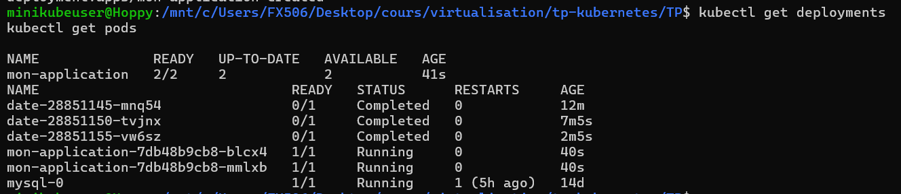

# Compte rendu Partie 3 :   Cronjob et HPA

## Partie 1 : CronJob

1) Création du fichier : cronjob.yaml

```bash 
apiVersion: batch/v1
kind: CronJob
metadata:
  name: date
spec:
  schedule: "*/5 * * * *"  
  jobTemplate:
    spec:
      template:
        spec:
          containers:
          - name: date
            image: busybox  
            command: ["date"]  
          restartPolicy: OnFailure 
```

Puis on execute cette commande : 
```bash 
kubectl apply -f cronjob.yml
```
Pour tester si le CronJob à bien été deployé je teste avec cette commande: 
```bash
kubectl get cronjob date
```

Je vérifie les évènements associés au Cronjob :  
```bash
kubectl logs date-manual-run-gxgqd #Affiche les logs du pod, pour vérifier la sortie de la commande date 
kubectl describe job date-manual-run # Donne des informations détaillées sur le job, son statut et les événements associés 
kubectl logs date-manual-run-gxgqd # Permet de revoir les logs du pod, idéal pour confirmer que la sortie de date a été correctement enregistrée
```

## Partie 2 : HPA 

1) Création du fichier : application.yml
    ```bash 
    apiVersion: apps/v1
    kind: Deployment
    metadata:
    name: mon-application
    spec:
    replicas: 2  
    selector:
        matchLabels:
        app: mon-application
    template:
        metadata:
        labels:
            app: mon-application
        spec:
        containers:
        - name: nginx-container
            image: nginx:latest  
            ports:
            - containerPort: 80 
    ```

Puis on execute cette commande : 
```bash 
kubectl apply -f application.yml
```
Vérification avec ces deux commandes : 
```bash
kubectl get deployments
kubectl get pods
```

Résultat : 


2) Mise à jour du fichier application.yml pour intégrer des requests et des limits 
```bash 
requests:
    memory: "128Mi"
    cpu: "100m"
    limits:
    memory: "256Mi"
    cpu: "200m"
```

J'éxécute cette commande pour mettre à jour : 
```bash
kubectl apply -f application.yml
```

Puis je vérifie que les ressources ont bien été appliquées : 


3) Création du fichier hpa-application.yml : 
```bash 
apiVersion: autoscaling/v1
kind: HorizontalPodAutoscaler
metadata:
  name: mon-application
spec:
  scaleTargetRef:
    apiVersion: apps/v1
    kind: Deployment
    name: mon-application
  minReplicas: 2 
  maxReplicas: 5  
  metrics:
  - type: Resource
    resource:
      name: cpu
      targetAverageUtilization: 50  
```
On applique les modifications : 
```bash 
kubectl apply -f hpa-application.yml
```

On vérifie l'état du HPA avec cette commande :
```bash 
kubectl get hpa mon-application

```

Résultat : 


4) L'objectif de la configuration de l'Horizontal Pod Autoscaler (HPA) est d'assurer la scalabilité automatique de l'application déployée sur Kubernetes en fonction de l'utilisation des ressources (CPU). Le résultat attendu est le suivant :

Autoscaling basé sur le CPU : Le Horizontal Pod Autoscaler (HPA) surveille en continu l'utilisation du CPU des pods de l'application mon-application. Si l'utilisation moyenne du CPU dépasse un seuil prédéfini (par exemple 50%), l'HPA crée automatiquement de nouveaux pods pour gérer la charge accrue.

Comportement dynamique des réplicas :
Lorsque l'utilisation du CPU est faible : Le nombre de réplicas reste stable, au minimum 2 réplicas.
Lorsque l'utilisation du CPU dépasse 50% : Le nombre de réplicas augmente automatiquement, jusqu'à un maximum de 5 réplicas, pour répondre à la demande.
Lorsque l'utilisation du CPU redescend : L'HPA réduit le nombre de réplicas pour revenir à la configuration minimale, optimisant ainsi l'utilisation des ressources.
Test de la scalabilité : Une fois l'HPA configuré, l'application doit pouvoir gérer de manière dynamique les pics de charge, ajoutant ou supprimant des pods en fonction de la demande, sans intervention manuelle. Cela permet d'assurer une performance optimale tout en minimisant l'usage excessif des ressources.

5) Utilisations des commandes : 
```bash 
kubectl expose deployment mon-application --port=80 --type=LoadBalancer
kubectl get svc
```

Résultat :


6) Voici la commande que j'ai utilisé pour vérifier le HPA
```bash
kubectl get hpa
```

7) Colonnes retournées par kubectl get hpa

NAME :

Le nom de l'HPA, qui est souvent le même que le nom de la ressource ciblée (par exemple, un Deployment ou un ReplicaSet) avec laquelle il est associé. Dans notre cas, ce serait probablement mon-application.

REFERENCE :

La ressource Kubernetes surveillée par l'HPA, sous le format Type/Nom (par exemple, Deployment/mon-application). Cela indique le déploiement ou autre ressource que l’HPA va scaler automatiquement en fonction de l'utilisation des ressources.

TARGETS :

Montre l’utilisation actuelle des ressources par rapport aux seuils définis dans l’HPA. Pour un HPA basé sur l'utilisation du CPU, cette colonne montre la consommation actuelle par rapport au seuil cible, dans le format Actuel/Seuil (par exemple, 45%/50%). Si l'utilisation actuelle dépasse le seuil défini, l'HPA va ajouter des réplicas jusqu'à atteindre un équilibre autour du seuil.

MINPODS :

Le nombre minimal de réplicas que l’HPA doit maintenir, même si l'utilisation des ressources est inférieure au seuil. Cela évite que le nombre de réplicas descende en dessous d’un certain seuil, ce qui pourrait nuire à la disponibilité de l'application.

MAXPODS :

Le nombre maximal de réplicas que l’HPA est autorisé à créer. Ce plafond permet de contrôler les coûts et l'utilisation des ressources en évitant une croissance incontrôlée du nombre de réplicas.

REPLICAS :

Le nombre actuel de réplicas alloués par l'HPA en fonction de l'utilisation des ressources. Ce nombre augmente lorsque l'utilisation dépasse le seuil, et diminue lorsque l'utilisation est inférieure au seuil, dans les limites des valeurs de MINPODS et MAXPODS.

AGE :

Le temps écoulé depuis la création de l’HPA. Cela permet de savoir depuis combien de temps l'HPA est en place et fonctionne sur le cluster.

8) 


