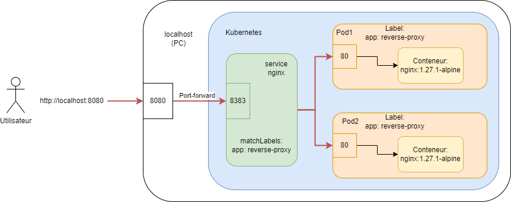
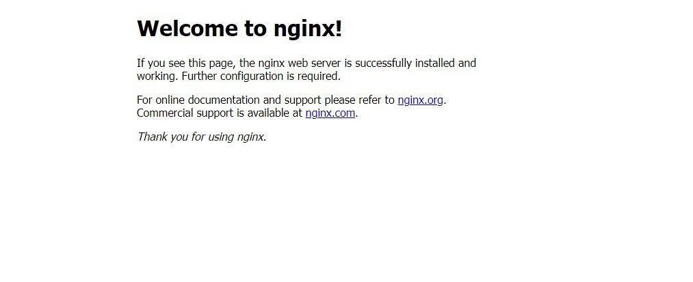
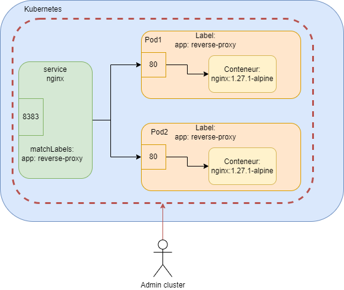

# TP Kubernetes
## Livrables

 - Un document (PDF, Word, Markdown...) vos réponses aux questions ❓, vos captures d'écrans 📸, les commandes utilisées et tout ce qui semble être important pour vous ! (Points de blocage, solutions utilisée, réflexions)

- Un dépôt gitlab/github avec vos fichiers YAML 📄

## Installation

 - [ ] [Docker](https://docs.docker.com/desktop/)
 - [ ] [Kubectl](https://kubernetes.io/docs/tasks/tools/#kubectl)
 - [ ] [Minikube](https://minikube.sigs.k8s.io/docs/start/?arch=%2Flinux%2Fx86-64%2Fstable%2Fbinary+download)

## Partie 1
### Pré-requis

 - [ ] Démarrer Docker
 - [ ] Démarrer Minikube :
> minikube start --driver=docker

> minikube status
 - [ ] Tester kubectl :
> kubectl version

L'arborescence du projet avec quelques exemples est disponible dans le [dossier TP](https://gitlab.com/aurelienburet1/kubernetes/-/tree/main/TP?ref_type=heads)

*ChatGPT et autres outils sont autorisés, mais peu utiles. Le code YAML retourné peut inclure des objets Kubernetes non vus en cours pour le moment.*

*Je reste disponible pour toute question, n’hésitez pas ! 😁*

### Namespaces
Dans le cadre de ce TP nous allons isoler nos différents services de la façon suivante :

- Un namespace « front » dédié au serveur web NGINX utilisé comme reverse proxy
- Un namespace « middle » dédié au service WordPress
- Un namespace « database » dédié à la base de données MySQL

1. 📄 Créer les 3 namespaces (fichiers YAML et non depuis kubectl) [Documentation](https://kubernetes.io/docs/tasks/administer-cluster/namespaces/#creating-a-new-namespace)
2. 📸 Visualiser la liste des namespaces sur le cluster Minikube
> kubectl get namespaces
3. Déployer les 3 namespaces
> kubectl apply -f <nom_du_ns>.yml
4. Visualiser la configuration d'un namespace créé
> kubectl describe namespace <front|middle|database>
5. 📸 Visualiser la liste des namespaces sur le cluster Minikube
> kubectl get namespaces

---
*Livrables attendus : 3 fichiers YAML, la liste des commandes utilisées, 2 captures d'écran*

### NGINX
Le service Nginx est utilisé comme reverse proxy pour le service WordPress.

Les fichiers YAML concernant le reverse proxy NGINX sont à déposer dans le dossier TP/front.

 1. 📄 Créer un fichier YAML `nginx-deployment.yml`, au sein de ce fichier ajoutez y une ressource de type `Deployment` qui utilise le nom `nginx`.
Cette ressource match et déploie `2`replicas d'un pod qui a pour label `app: reverse-proxy`. 
Ce pod contient un conteneur docker nommé `nginx`qui utilise l'image publique `nginx`dans sa version `1.27.1-alpine`

2. 📄 Créer un fichier YAML `nginx-service.yml`, au sein de ce fichier ajoutez- y une ressource de type `Service` qui a pour nom `nginx`
Ce service doit utiliser le protocole `TCP`
et écoute sur le port `8383`. Il redirige le flux sur le port `80`les pods quit on un label `app: reverse-proxy`

3. Déployer les ressources créées dans le namespace `front` [Documentation](https://cloud.google.com/blog/products/containers-kubernetes/kubernetes-best-practices-organizing-with-namespaces?hl=en#:~:text=Creating%20Resources%20in%20the%20Namespace)

4. Vérifier les events du namespace et le bon démarrage des pods et de leurs conteneurs
❓ Quelles sont les 2 commandes utilisées ?

5. Créer une redirection de port (port-forwarding) pour contacter votre service qui écoute sur le port 8383. Si la configuration et le déploiement des ressources sont corrects, le serveur web Nginx affiche sa page par défaut.
> kubectl port-forward -n <namespace_du_nginx> svc/<nom_du_svc> <port_local_de_votre_pc>:<port_ecoute_svc>

Exemple : 
> kubectl port-forward -n default svc/nginx 8080:8383
Puis http://localhost:8080

6. Accéder depuis votre navigateur : http://localhost:8080

Résultat attendu : 

7. ❓ A quoi correspond les pointillés violet ? 

8. ❓ A quoi correspond les pointillés ? 

---
*Livrables attendus : 2 fichiers YAML, la liste des commandes utilisées, 1 capture d'écran, les réponses aux 3 questions*
